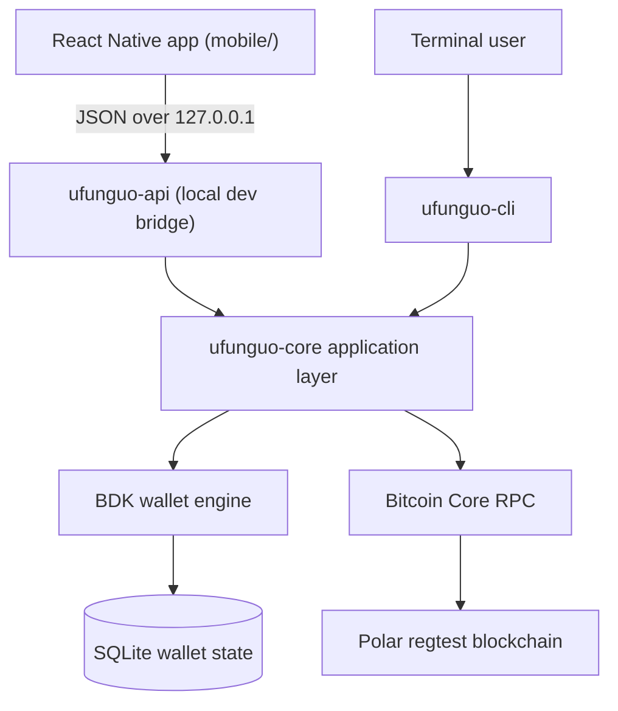

# Ufunguo Wallet

Ufunguo is a transparent, non-custodial Bitcoin wallet built in Rust, with a bare React Native app for beginners who want to see what happens under the hood. Its distinguishing feature is **Explain Mode**: every important action — revealing an address, syncing, building a PSBT, signing, waiting for confirmations — is explained visually as it happens.

> **Status:** educational regtest capstone. Do not use Ufunguo with real bitcoin.

`ufunguo` means **key** in Swahili.

## What it demonstrates

- BIP39 mnemonic creation and restoration
- BIP32 hierarchical deterministic keys
- BIP84 native SegWit receive and change keychains
- Fresh address generation and address-usage tracking
- Bitcoin Core synchronization through RPC
- Confirmed, unconfirmed and immature balances
- Transaction history, UTXOs and confirmation counts
- Bitcoin Core fee estimation with a documented regtest fallback
- PSBT construction, local signing and transaction finalization
- Transaction broadcasting and status polling
- SQLite wallet persistence between runs
- Multiple independent wallets through separate database files
- A mobile app (iOS first, Android compatible) with onboarding, receive/send journeys, a transaction review diagram, confirmation timelines and a **Bitcoin Lab** for addresses, UTXOs, derivation paths and PSBTs

<p align="center">
  
  
  
</p>

## Architecture



Rust is the source of truth for all Bitcoin logic. The mobile app never derives keys, selects coins, calculates fees, builds or signs transactions; it renders what Rust returns. Bitcoin Core supplies blockchain data and relays signed transactions; it never receives the recovery phrase, and its RPC credentials never leave the Rust process.

- [docs/architecture.md](docs/architecture.md) — key, receive and send lifecycles
- [docs/mobile-architecture.md](docs/mobile-architecture.md) — the Rust ↔ mobile boundary, HTTP contract and security boundaries
- [docs/mobile-demo.md](docs/mobile-demo.md) — the live demo script

## Workspace

```text
rust/
├── crates/
│   ├── ufunguo-core/   wallet rules, keys, persistence, node integration and the shared application layer
│   ├── ufunguo-cli/    commands, prompts and terminal presentation
│   └── ufunguo-api/    local regtest-only HTTP bridge for the mobile app
├── Cargo.toml
└── .env.example
mobile/                 bare React Native TypeScript app (no Expo)
docs/                   architecture, mobile boundary, demo script, screenshots
```

## Requirements

- Rust toolchain
- Bitcoin Core regtest node (Polar is convenient)
- RPC URL, username and password for that node
- For the mobile app: Node.js ≥ 22.11, Xcode with an iOS simulator and CocoaPods (iOS), or JDK 17 + Android Studio with an emulator (Android)

## Setup

```bash
git clone https://github.com/ro61zzy/ufunguo-wallet.git
cd ufunguo-wallet/rust
cp .env.example .env
```

Fill `.env` with the RPC credentials shown by Polar:

```dotenv
BITCOIN_RPC_URL=http://127.0.0.1:18443
BITCOIN_RPC_USER=your_polar_rpc_user
BITCOIN_RPC_PASSWORD=your_polar_rpc_password
```

Verify the workspace:

```bash
cargo fmt --check
cargo test
cargo clippy --workspace --all-targets -- -D warnings
```

## Quick start

Create a named wallet:

```bash
cargo run --package ufunguo-cli -- \
  --database wallets/alice.sqlite \
  wallet create
```

Generate a fresh receiving address:

```bash
cargo run --package ufunguo-cli -- \
  --database wallets/alice.sqlite \
  wallet receive
```

After sending regtest bitcoin to that address, synchronize and inspect it:

```bash
cargo run --package ufunguo-cli -- --database wallets/alice.sqlite wallet sync
cargo run --package ufunguo-cli -- --database wallets/alice.sqlite wallet addresses
cargo run --package ufunguo-cli -- --database wallets/alice.sqlite wallet balance
cargo run --package ufunguo-cli -- --database wallets/alice.sqlite wallet transactions
cargo run --package ufunguo-cli -- --database wallets/alice.sqlite wallet utxos
```

Create a second wallet and send to it:

```bash
cargo run --package ufunguo-cli -- --database wallets/bob.sqlite wallet create
cargo run --package ufunguo-cli -- --database wallets/bob.sqlite wallet receive

cargo run --package ufunguo-cli -- \
  --database wallets/alice.sqlite \
  wallet send <BOB_REGTEST_ADDRESS> 25000000
```

Ufunguo reviews the destination, amount, selected inputs, fee and change before asking for the recovery phrase and broadcasting.

Track the resulting transaction:

```bash
cargo run --package ufunguo-cli -- \
  --database wallets/alice.sqlite \
  wallet status <TXID> --watch --interval 2
```

Mine a block in Polar while the watcher is running. Ufunguo will synchronize until it detects the confirmation and then stop.

For a complete presentation sequence, see [docs/mobile-demo.md](docs/mobile-demo.md).

## Mobile app

### 1. Run the Rust API

```bash
cd rust
cargo run -p ufunguo-api
```

It listens on `http://127.0.0.1:8787`, reads Bitcoin Core credentials from `rust/.env`, and serves the wallets in `rust/wallets/` — the same `<name>.sqlite` files the CLI uses with `--database wallets/<name>.sqlite`. Override with `UFUNGUO_API_BIND` and `UFUNGUO_WALLET_DIR`; non-loopback binds are refused unless `UFUNGUO_API_ALLOW_NON_LOCAL=1`.

### 2. iOS

```bash
cd mobile
npm install
cd ios && pod install && cd ..
npm start        # Metro bundler (separate terminal)
npm run ios      # build and launch in the simulator
```

### 3. Android

```bash
cd mobile
npm install
npm start
npm run android  # requires a running emulator
```

The Android emulator reaches the host's API at `http://10.0.2.2:8787` automatically. Physical devices cannot reach it, by design: the API only listens on localhost.

### Mock mode

Settings → Data source → **Mock data** switches to typed fixtures for UI work without a node. Nothing reaches Rust in this mode.

### Mobile checks

```bash
cd mobile
npm run lint
npm run typecheck
npm test -- --runInBand
npm run test:e2e   # opt-in live Alice → Bob payment; see docs/mobile-demo.md
```

## MVP coverage

| Requirement | Ufunguo implementation |
|---|---|
| Create wallet | Generates a 12-word BIP39 mnemonic |
| Restore wallet | Validates a mnemonic and rebuilds its deterministic BIP84 wallet |
| Hierarchical keys | External `m/84'/1'/0'/0/*` and internal `m/84'/1'/0'/1/*` keychains |
| Receive addresses | Reveals, persists and classifies addresses as used or unused |
| Chain sync | Scans blocks and the mempool through Bitcoin Core RPC |
| Balance | Separates confirmed, unconfirmed and immature funds |
| History | Shows incoming/outgoing amount, block height and confirmations |
| PSBT signing | Builds a PSBT, signs owned inputs locally and finalizes it |
| Broadcast | Submits the signed transaction through Bitcoin Core |
| Status polling | Watches a TXID until it confirms |
| Persistence | Stores BDK changes in SQLite |
| Mobile interface | React Native app over a local Rust API, with Explain Mode and Bitcoin Lab |

## Safety boundaries

- Ufunguo currently supports **regtest only**.
- Wallet databases are not encrypted.
- Recovery phrases are entered locally using a hidden terminal prompt, but the generated phrase is displayed once during creation.
- A database file belongs to one mnemonic. Ufunguo refuses to overwrite an existing wallet during `create`.
- Separate `--database` paths create independent wallets; this is not a multi-user authentication system.
- Production use would require encrypted secret storage, stronger process isolation, backups, network selection and a security review.

### Mobile development bridge

- `ufunguo-api` is a **local development bridge**, bound to `127.0.0.1` and regtest-only. A production mobile wallet should replace it with an in-process Rust library exposed through a native bridge such as **UniFFI**, with keys held in the Secure Enclave / Android Keystore.
- To sign, the app sends the recovery phrase once over localhost. The app keeps it only in component state, in a secure text field, and clears it immediately; the API holds it in a zeroizing buffer and never logs it.
- A newly created wallet's phrase is returned once and shown once. It is never put in navigation state, query caches, AsyncStorage or logs. AsyncStorage holds only non-secret preferences.
- Bitcoin Core credentials stay in `rust/.env` and are never sent to the app.
- The reviewed PSBT is the one that gets signed: previews are stored server-side under a single-use, 10-minute `previewId`.
- Wallet names are validated (`^[a-z0-9][a-z0-9_-]{0,31}$`) so wallet files cannot escape the configured directory, and create/restore never overwrite another wallet.

## Roadmap

- Replace the local HTTP bridge with a UniFFI native module
- Hardware-backed key storage and production-grade backup UX
- Automated regtest network provisioning for CI
- Accessibility review with VoiceOver/TalkBack users

## License

This capstone is currently provided for educational use. A formal open-source license will be added before accepting external contributions.
