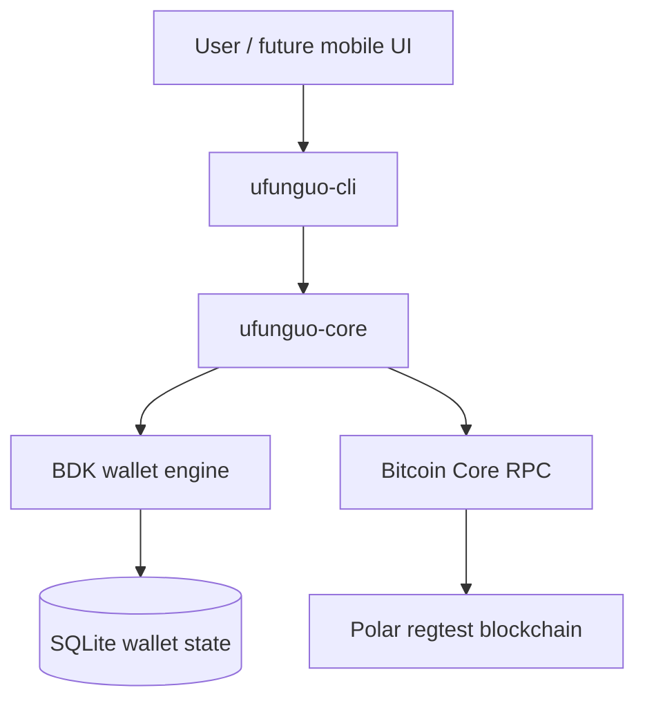

# Ufunguo Wallet

Ufunguo is a transparent, non-custodial Bitcoin wallet built in Rust. It is designed for people learning how Bitcoin wallets work: each CLI command exposes the wallet operation being performed instead of hiding the entire flow behind a single balance screen.

> **Status:** educational regtest capstone. Do not use Ufunguo with real bitcoin.

`ufunguo` means **key** in Swahili.

## What it demonstrates

- BIP39 mnemonic creation and restoration
- BIP32 hierarchical deterministic keys
- BIP84 native SegWit receive and change keychains
- Fresh address generation and address-usage tracking
- Bitcoin Core synchronization through RPC
- Confirmed, unconfirmed and immature balances
- Transaction history, UTXOs and confirmation counts
- Bitcoin Core fee estimation with a documented regtest fallback
- PSBT construction, local signing and transaction finalization
- Transaction broadcasting and status polling
- SQLite wallet persistence between runs
- Multiple independent wallets through separate database files

## Architecture



The recovery phrase and private keys remain on the wallet side. Bitcoin Core supplies blockchain data, validates transactions and broadcasts signed transactions; it does not receive the recovery phrase.

See [docs/architecture.md](docs/architecture.md) for the detailed flow.

## Workspace

```text
rust/
├── crates/
│   ├── ufunguo-core/   wallet rules, keys, persistence and node integration
│   └── ufunguo-cli/    commands, prompts and terminal presentation
├── Cargo.toml
└── .env.example
```

## Requirements

- Rust toolchain
- Bitcoin Core regtest node (Polar is convenient)
- RPC URL, username and password for that node

## Setup

```bash
git clone https://github.com/ro61zzy/ufunguo-wallet.git
cd ufunguo-wallet/rust
cp .env.example .env
```

Fill `.env` with the RPC credentials shown by Polar:

```dotenv
BITCOIN_RPC_URL=http://127.0.0.1:18443
BITCOIN_RPC_USER=your_polar_rpc_user
BITCOIN_RPC_PASSWORD=your_polar_rpc_password
```

Verify the workspace:

```bash
cargo fmt --check
cargo test
cargo clippy --workspace --all-targets -- -D warnings
```

## Quick start

Create a named wallet:

```bash
cargo run --package ufunguo-cli -- \
  --database wallets/alice.sqlite \
  wallet create
```

Generate a fresh receiving address:

```bash
cargo run --package ufunguo-cli -- \
  --database wallets/alice.sqlite \
  wallet receive
```

After sending regtest bitcoin to that address, synchronize and inspect it:

```bash
cargo run --package ufunguo-cli -- --database wallets/alice.sqlite wallet sync
cargo run --package ufunguo-cli -- --database wallets/alice.sqlite wallet addresses
cargo run --package ufunguo-cli -- --database wallets/alice.sqlite wallet balance
cargo run --package ufunguo-cli -- --database wallets/alice.sqlite wallet transactions
cargo run --package ufunguo-cli -- --database wallets/alice.sqlite wallet utxos
```

Create a second wallet and send to it:

```bash
cargo run --package ufunguo-cli -- --database wallets/bob.sqlite wallet create
cargo run --package ufunguo-cli -- --database wallets/bob.sqlite wallet receive

cargo run --package ufunguo-cli -- \
  --database wallets/alice.sqlite \
  wallet send <BOB_REGTEST_ADDRESS> 25000000
```

Ufunguo reviews the destination, amount, selected inputs, fee and change before asking for the recovery phrase and broadcasting.

Track the resulting transaction:

```bash
cargo run --package ufunguo-cli -- \
  --database wallets/alice.sqlite \
  wallet status <TXID> --watch --interval 2
```

Mine a block in Polar while the watcher is running. Ufunguo will synchronize until it detects the confirmation and then stop.

For a complete presentation sequence, see [docs/demo.md](docs/demo.md).

## MVP coverage

| Requirement | Ufunguo implementation |
|---|---|
| Create wallet | Generates a 12-word BIP39 mnemonic |
| Restore wallet | Validates a mnemonic and rebuilds its deterministic BIP84 wallet |
| Hierarchical keys | External `m/84'/1'/0'/0/*` and internal `m/84'/1'/0'/1/*` keychains |
| Receive addresses | Reveals, persists and classifies addresses as used or unused |
| Chain sync | Scans blocks and the mempool through Bitcoin Core RPC |
| Balance | Separates confirmed, unconfirmed and immature funds |
| History | Shows incoming/outgoing amount, block height and confirmations |
| PSBT signing | Builds a PSBT, signs owned inputs locally and finalizes it |
| Broadcast | Submits the signed transaction through Bitcoin Core |
| Status polling | Watches a TXID until it confirms |
| Persistence | Stores BDK changes in SQLite |

## Safety boundaries

- Ufunguo currently supports **regtest only**.
- Wallet databases are not encrypted.
- Recovery phrases are entered locally using a hidden terminal prompt, but the generated phrase is displayed once during creation.
- A database file belongs to one mnemonic. Ufunguo refuses to overwrite an existing wallet during `create`.
- Separate `--database` paths create independent wallets; this is not a multi-user authentication system.
- Production use would require encrypted secret storage, stronger process isolation, backups, network selection and a security review.

## Roadmap

- JSON/application boundary for a mobile client
- Bare React Native educational interface
- Wallet selector and guided receive/send journeys
- Automated regtest integration tests
- Encrypted key storage and production-grade backup UX

## License

This capstone is currently provided for educational use. A formal open-source license will be added before accepting external contributions.
