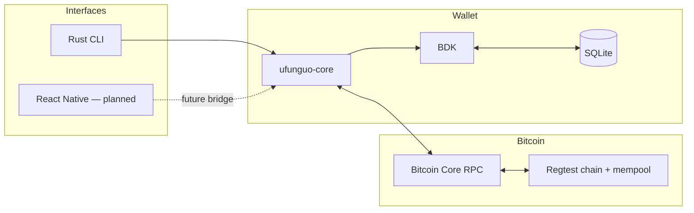
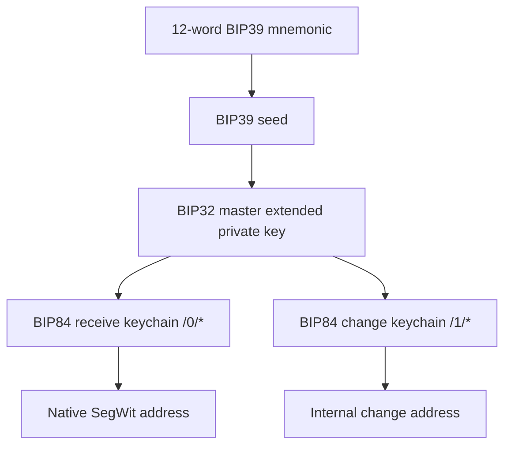
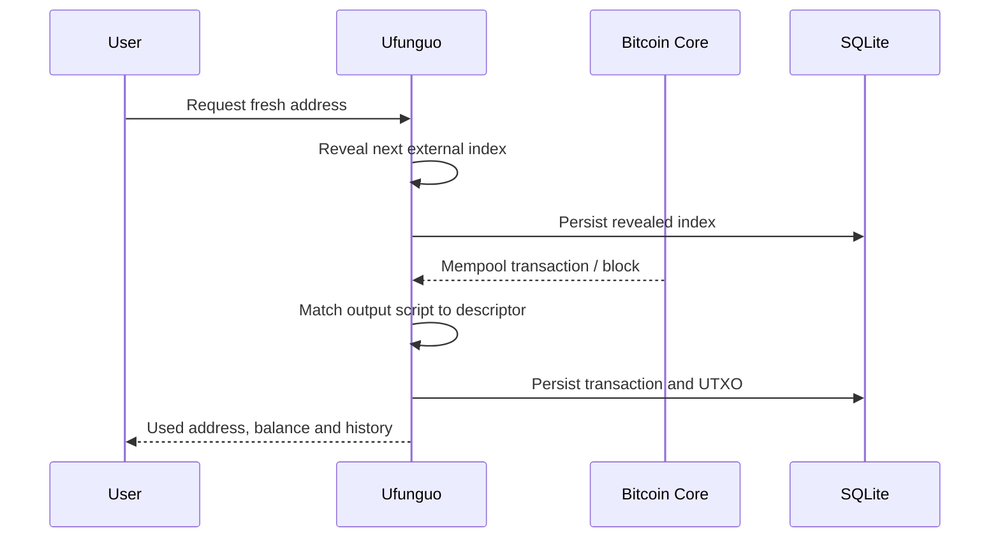
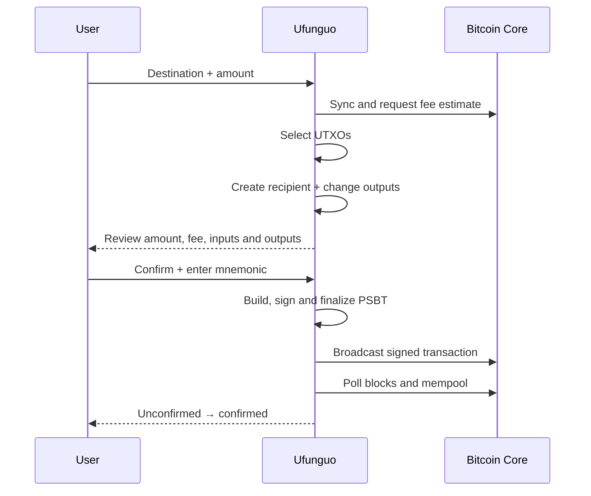

# Ufunguo architecture

## Design goal

Ufunguo separates Bitcoin wallet behavior from presentation. `ufunguo-core` owns wallet rules and can later power a CLI, a mobile bridge or another interface without duplicating key derivation and transaction logic.



## Key lifecycle



On regtest, Ufunguo uses coin type `1'`:

- Receive: `m/84'/1'/0'/0/*`
- Change: `m/84'/1'/0'/1/*`

The mnemonic deterministically recreates the same master key, descriptors and addresses. SQLite stores revealed indices, chain state, transactions and UTXOs; it is not the source of the wallet's identity.

## Receive lifecycle



## Send lifecycle



Bitcoin Core never signs the transaction. Ufunguo constructs and signs locally, then sends only the finalized transaction to the node.

## Crate responsibilities

| Component | Responsibility |
|---|---|
| `bitcoin` | Addresses, amounts, transactions, PSBTs and network types |
| `bip39` | Mnemonic generation and validation |
| `bdk_wallet` | Descriptors, address derivation, chain state, UTXOs, coin selection and PSBT construction |
| BDK SQLite persistence | Durable wallet state between commands |
| `bdk_bitcoind_rpc` / `bitcoincore-rpc` | Block/mempool synchronization, fee estimation and broadcasting |
| `clap` | CLI command parsing |
| `zeroize` | Clears temporary recovery-phrase strings after parsing |

## Multiple wallets

Each database path represents one independent wallet:

```text
wallets/alice.sqlite      mnemonic A + descriptors A + state A
wallets/bob.sqlite        mnemonic B + descriptors B + state B
wallets/presentation.sqlite
```

This supports one operator managing several wallets locally. It deliberately does not claim to provide user accounts, authorization or encrypted multi-tenant storage.
