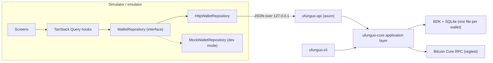

# Ufunguo mobile architecture

This document defines how the Ufunguo React Native client talks to the Rust wallet, and which Rust code has to move so that the CLI and the mobile bridge share one implementation.

> **Scope:** regtest-only educational capstone. The HTTP bridge described here is a local development tool, not a production architecture.

## 1. Audit of the existing Rust workspace

### Crates

| Crate | Role today |
|---|---|
| `ufunguo-core` | Keys (`keys.rs`), BDK wallet and SQLite persistence (`wallet.rs`), Bitcoin Core RPC (`node.rs`) |
| `ufunguo-cli` | `clap` commands, prompts and terminal output (`main.rs`, ~970 lines) |

### Public `ufunguo-core` API

| Item | Purpose |
|---|---|
| `generate_mnemonic()`, `parse_mnemonic(&str)` | BIP39 12-word phrase generation and validation |
| `WalletKeys::from_mnemonic(&Mnemonic, Network)` | BIP32 master key; seed is zeroized after derivation |
| `UfunguoWallet::open_or_create(&WalletKeys, path)` | Create or load a BIP84 wallet in SQLite (descriptors are checked against the database) |
| `UfunguoWallet::open_existing(path, Network)` | Load a wallet without the mnemonic (public descriptors only) |
| `balance()`, `transactions()`, `transaction(txid)`, `unspent_outputs()`, `addresses()` | Read wallet state |
| `next_receive_address()` | Reveal and persist the next external index |
| `build_psbt(&Address, Amount, FeeRate)` | BDK coin selection + PSBT; persists any revealed change index |
| `sign_psbt(&mut Psbt, &WalletKeys)` | Sign owned inputs with the master xpriv and finalize |
| `sync_wallet(&mut wallet, url, user, pass)` | Emit blocks and mempool from Bitcoin Core into BDK, persist |
| `estimate_fee_rate(...)`, `broadcast_transaction(...)`, `bitcoin_node_status(...)` | Node RPC helpers |
| `RECEIVE_PATH`, `CHANGE_PATH` | `m/84'/1'/0'/0/*` and `m/84'/1'/0'/1/*` |

Important property: BDK persists the **public** descriptors in SQLite. The extended private key is never written to the database, which is why signing requires the mnemonic again.

### CLI commands

`create`, `restore`, `receive`, `addresses`, `sync`, `balance`, `transactions`, `utxos`, `fees`, `build-psbt`, `sign-psbt`, `send`, `broadcast`, `status [--watch]` — all scoped by `--database <path>`.

### Tests

10 unit tests in `ufunguo-core` (mnemonic generation/validation, deterministic fingerprint, regtest wallet creation, receive vs change addresses, persisted receive index, address usage tracking, fee-rate kvB→vB rounding). No CLI tests.

### CLI-only logic that the mobile bridge also needs

These helpers live in `ufunguo-cli/src/main.rs` and contain wallet rules rather than presentation. They move to a new application layer in `ufunguo-core` (`service.rs`, `directory.rs`) so the CLI and the API call the same code:

| CLI helper | Moves to core as | Why |
|---|---|---|
| `RpcConfig`, `rpc_config_or_exit` | `RpcConfig::from_env()` (password redacted in `Debug`) | Both interfaces read the same `.env` |
| `resolve_fee_rate*`, `manual_fee_rate_or_exit`, `DEFAULT_FEE_RATE_SAT_VB` | `resolve_fee_rate()` → `ResolvedFeeRate { rate, source }` | Fallback rule must be identical everywhere |
| `parse_regtest_address_or_exit` | `parse_regtest_address()` | Network check is a wallet rule |
| `ensure_regtest_node` | `ensure_regtest_node()` | Refuse non-regtest nodes in both interfaces |
| `transaction_direction_and_amount` | `WalletTransaction::direction()` / `net_amount()` | Direction is derived from sent/received |
| `print_psbt_summary` (input/output classification) | `UfunguoWallet::summarize_psbt()` → `TransactionPreview` | Recipient/change labelling must be computed once, using wallet descriptors rather than string comparison |
| `create_wallet` overwrite check | `create_wallet(path)` using an atomic `create_new` claim | Never overwrite another wallet's database |
| `restore_wallet` | `restore_wallet(path, phrase)` | Same validation, mismatch detection |
| `send_bitcoin` sign + broadcast steps | `sign_and_broadcast()` | One signing path |

New core capabilities required by the mobile UI: wallet overview (address/UTXO counts, height, latest transaction), transaction timestamps and fees, PSBT input values and derivation info, a validated wallet directory.

## 2. Target structure

```text
ufunguo-wallet/
├── rust/crates/
│   ├── ufunguo-core/   keys, BDK wallet, node RPC + application layer (service.rs, directory.rs)
│   ├── ufunguo-cli/    terminal presentation over the application layer
│   └── ufunguo-api/    local HTTP/JSON bridge for the simulator (axum)
├── mobile/             bare React Native TypeScript app (no Expo)
└── docs/
```



## 3. The Rust boundary

**Rust owns every Bitcoin decision.** TypeScript never derives keys, selects coins, computes fees, builds or signs transactions. The mobile client renders data and collects intent (destination, amount, fee preference, explicit confirmation).

| Concern | Owner |
|---|---|
| Mnemonic generation / validation | Rust |
| Address derivation and index persistence | Rust (BDK) |
| Coin selection, change, fee, PSBT | Rust (BDK) |
| Signing and finalization | Rust |
| Broadcast and confirmation tracking | Rust → Bitcoin Core |
| Satoshi → BTC string formatting | TypeScript (presentation only) |
| Explain Mode copy and diagrams | TypeScript |

### Transaction review is the transaction that gets signed

BDK coin selection is randomized, so rebuilding the PSBT at signing time could select different coins than the user reviewed. The API therefore stores each preview's PSBT in memory under a random `previewId` (single use, short TTL). `send` takes `previewId` + mnemonic and signs exactly that PSBT.

## 4. HTTP contract

All amounts are **integer satoshis** (`…Sats`, JSON numbers; max supply 2.1×10¹⁵ is below 2⁵³). Fee rates are integer sat/vB. JSON uses camelCase.

| Method | Path | Notes |
|---|---|---|
| GET | `/health` | `{ status, network: "regtest", regtestOnly: true, node: { reachable, blocks? } }` |
| GET | `/api/wallets` | Wallet names found in the wallet directory |
| POST | `/api/wallets` | `{ name }` → creates; returns the mnemonic **once** |
| POST | `/api/wallets/:wallet/restore` | `{ mnemonic }` |
| GET | `/api/wallets/:wallet/overview` | Balances, counts, height, latest transaction |
| POST | `/api/wallets/:wallet/sync` | Blocks scanned, mempool txs, new height |
| GET | `/api/wallets/:wallet/addresses` | Revealed receive/change addresses with index, path, used |
| POST | `/api/wallets/:wallet/addresses/receive` | Reveal + persist next external address |
| GET | `/api/wallets/:wallet/transactions` | History, newest first |
| GET | `/api/wallets/:wallet/transactions/:txid` | One transaction with inputs/outputs |
| GET | `/api/wallets/:wallet/utxos` | Outpoint, value, keychain, index, confirmation |
| GET | `/api/fees` | Estimates for several targets + fallback source |
| POST | `/api/wallets/:wallet/transactions/preview` | `{ address, amountSats, confirmationTarget? , feeRateSatPerVb? }` → `previewId`, inputs, outputs, fee |
| POST | `/api/wallets/:wallet/transactions/send` | `{ previewId, mnemonic }` → `txid` |

Errors always use:

```json
{ "error": { "code": "wallet_not_found", "message": "Wallet alice was not found" } }
```

Codes: `invalid_wallet_name`, `wallet_not_found`, `wallet_exists`, `wallet_mismatch`, `invalid_mnemonic`, `invalid_address`, `wrong_network`, `invalid_amount`, `invalid_fee_rate`, `insufficient_funds`, `preview_not_found`, `signing_failed`, `broadcast_failed`, `transaction_not_found`, `invalid_txid`, `node_unavailable`, `bad_request`, `internal_error`.

### Wallet directory and names

- One configured directory (`UFUNGUO_WALLET_DIR`, default `rust/wallets`). A wallet named `alice` is `<dir>/alice.sqlite`.
- Names must match `^[a-z0-9][a-z0-9_-]{0,31}$`. This rejects `..`, `/`, `\`, absolute paths, NUL bytes and hidden files, so a resolved path can never leave the directory.
- `create` claims the file with `create_new` (atomic) and fails with `wallet_exists` instead of overwriting.
- `restore` into an existing name succeeds only when the mnemonic matches that database's descriptors; otherwise `wallet_mismatch`.
- Operations on one wallet are serialized with a per-wallet lock so two requests cannot race on BDK's derivation indices.

## 5. Security boundaries (development only)

| Boundary | Capstone behaviour | Production replacement |
|---|---|---|
| Transport | HTTP on `127.0.0.1` (`10.0.2.2` from the Android emulator), regtest-only | In-process Rust via **UniFFI** (or JSI); no socket |
| Mnemonic for signing | Sent once per send over loopback, held in `Zeroizing<String>`, never logged | Keys in the Secure Enclave / Android Keystore; signing inside the native library |
| Mnemonic at creation | Returned once in the create response, shown once, kept only in component state | Generated and stored natively; shown from secure storage |
| Bitcoin Core credentials | Only in `rust/.env`, read by the API process; never sent to the client | Wallet talks to its own node / Electrum / Esplora backend |
| CORS | Only `localhost` origins (simulators send no `Origin` header) | Not applicable without HTTP |
| Wallet databases | Unencrypted SQLite in one directory | Encrypted, per-app storage |
| Auth | None — wallets are separate files, not user accounts | Device-level auth, biometrics |

Client-side rules: the mnemonic never enters navigation params, TanStack Query caches, AsyncStorage or logs. Secret-bearing calls bypass `useMutation` so the result is not retained in the mutation cache. AsyncStorage only stores non-secret preferences (selected wallet, Explain Mode, mock mode).

## 6. Mobile application structure

```text
mobile/src/
├── api/          types.ts (contract), repository.ts (interface), http.ts, mock.ts, errors.ts
├── state/        AppSettings context (selected wallet, explain mode, mock mode)
├── hooks/        TanStack Query hooks per resource
├── theme/        tokens.ts (palette, spacing, radii, type)
├── components/   Button, Card, Badge, Screen, MoneyText, Mono, ExplainCard, Timeline, FlowDiagram, icons …
├── navigation/   Root stack (onboarding, modals) + bottom tabs
├── screens/      Onboarding, CreateWallet, RecoveryPhrase, RestoreWallet, Home, Activity,
│                 TransactionDetail, Receive, Send, ReviewTransaction, Lab, AddressDetail,
│                 WalletSwitcher, Settings
└── utils/        format.ts (sats ↔ BTC strings, truncation)
```

Navigation: a root native stack containing onboarding screens, the `Main` bottom tabs (Home, Activity, Bitcoin Lab, Settings) and modal screens (Receive, Send, Review, Transaction detail, Address detail, Wallet switcher).

Screens call hooks; hooks call the `WalletRepository`; only `HttpWalletRepository` calls `fetch`. The mock repository implements the same interface with typed fixtures so the UI can be built and demonstrated without a node.

## 7. Future: native bridge

The HTTP bridge exists because it lets the simulator use the real Rust wallet with zero native build plumbing. For a production mobile wallet:

1. Expose the `ufunguo-core` application layer through **UniFFI** (Swift + Kotlin bindings) and wrap it in a React Native Turbo Module.
2. Replace `HttpWalletRepository` with a `NativeWalletRepository` implementing the same interface — screens and hooks are unchanged.
3. Move key material into platform secure storage; sign without ever passing the mnemonic across the JS boundary.
4. Remove `ufunguo-api` from the shipped app.
