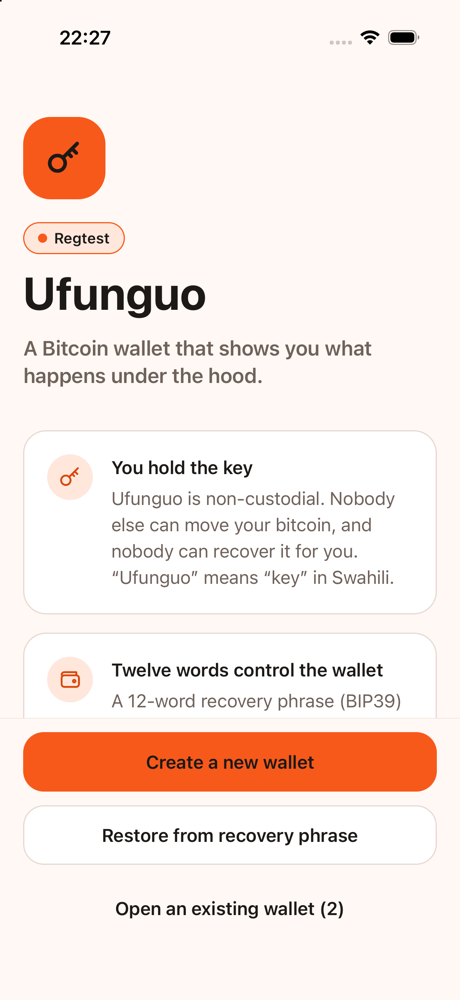
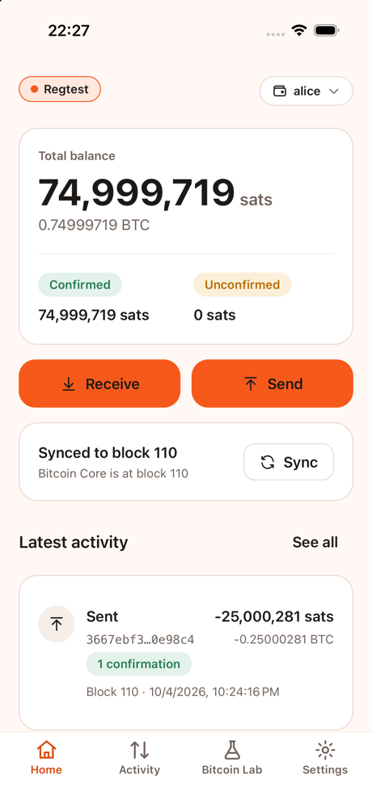
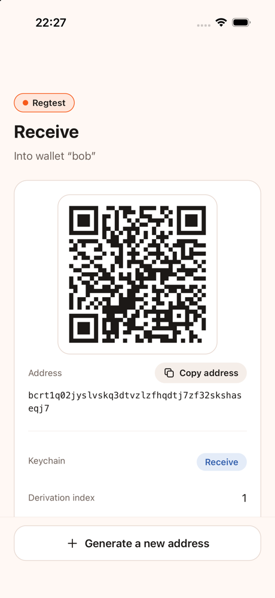
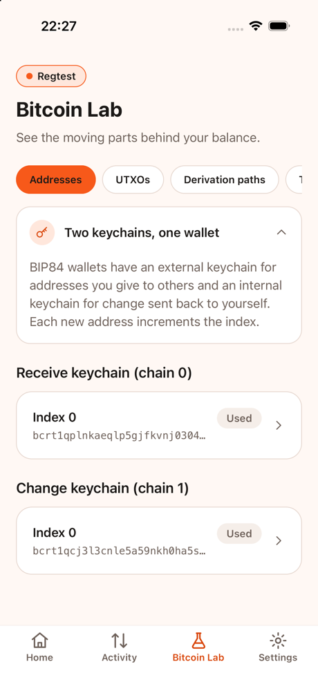
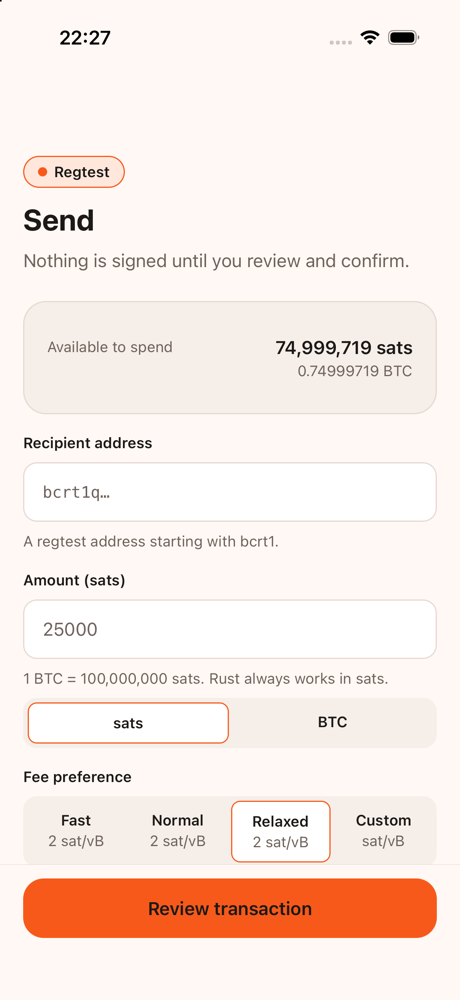
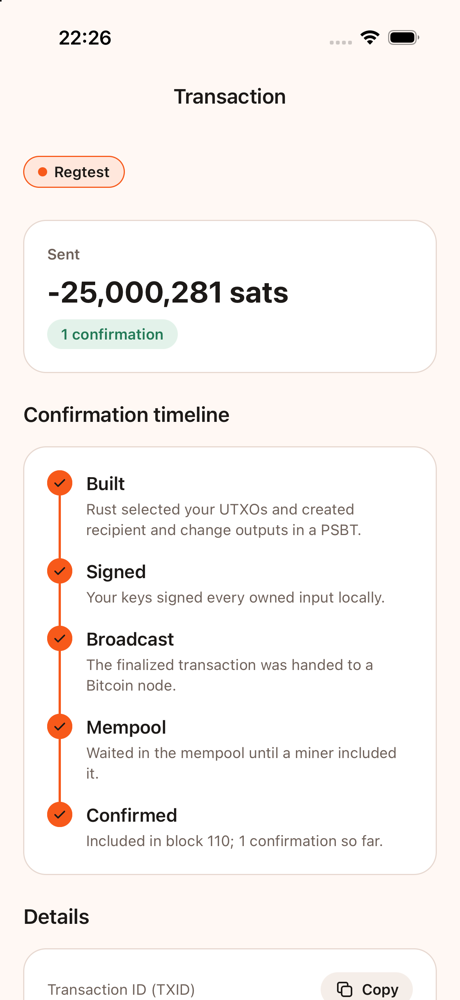
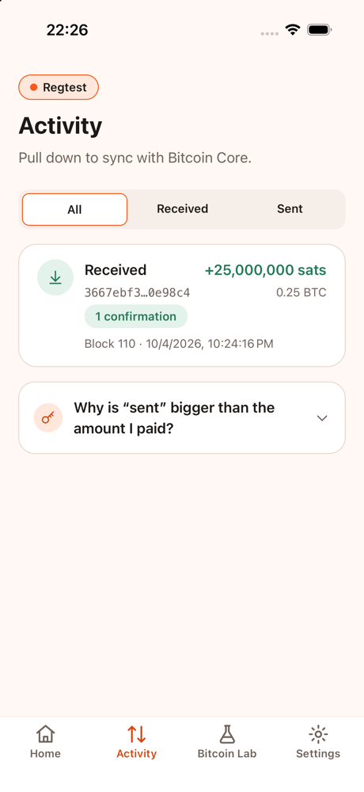

# Ufunguo mobile demo

A step-by-step script for presenting the Ufunguo mobile wallet on an iOS simulator with a Polar regtest network. Allow about ten minutes.

> **Regtest only.** Coins on this chain have no value. The local Rust API is a development bridge and binds to `127.0.0.1`.

## 1. Before the presentation

### Start Bitcoin Core

1. Open Polar and start a network with at least one Bitcoin Core node.
2. Copy the node's RPC credentials into `rust/.env` (see `rust/.env.example`).

### Start the Rust API

```bash
cd rust
cargo run -p ufunguo-api
```

Expected output:

```text
Ufunguo API — REGTEST ONLY development bridge. Do not use with real bitcoin.
Listening on http://127.0.0.1:8787
Wallet directory: …/rust/wallets
Bitcoin Core RPC: http://127.0.0.1:18443
```

Check it:

```bash
curl -s http://127.0.0.1:8787/health
# {"status":"ok","network":"regtest","regtestOnly":true,"node":{"reachable":true,…}}
```

Optional settings (environment variables):

| Variable | Default | Purpose |
|---|---|---|
| `UFUNGUO_API_BIND` | `127.0.0.1:8787` | Listen address. Non-loopback addresses are refused unless `UFUNGUO_API_ALLOW_NON_LOCAL=1`. |
| `UFUNGUO_WALLET_DIR` | `wallets` (relative to `rust/`) | Directory of `<name>.sqlite` wallets — the same files the CLI uses with `--database wallets/<name>.sqlite`. |

### Start the app

```bash
cd mobile
npm install
cd ios && pod install && cd ..
npm start            # Metro, in its own terminal
npm run ios          # builds and launches the simulator
```

Settings → Connection should show **Rust API** and a green **Block N** badge.

### Rehearsal shortcut (optional)

Development builds accept launch arguments, so you can jump to a screen without tapping:

```bash
xcrun simctl launch booted org.reactjs.native.example.Ufunguo \
  -ufunguoDevWallet alice -ufunguoDevURL ufunguo://lab
```

Paths: `welcome`, `home`, `activity`, `lab`, `settings`, `receive`, `send`, `wallets`, `create`, `restore`, `tx/<txid>`.

## 2. Live demo sequence

| # | Do this | Point out |
|---|---|---|
| 1 | Launch the app → **Onboarding** | Non-custodial, the 12 words *are* the wallet, UTXOs instead of balances, regtest badge |
| 2 | **Create a new wallet** → name it `alice` → **Generate my recovery phrase** | Rust generated the words. “What just happened?” explains BIP39 → BIP32 → BIP84 and that SQLite stores only public descriptors |
| 3 | Write down two words, **I’ve written them down**, confirm the two requested words | The phrase lived only in that screen’s memory; it was never stored by the app |
| 4 | **Home** shows 0 sats | “What your wallet knows”: revealed addresses, used addresses, UTXOs, last synced block |
| 5 | **Receive** | QR, derivation index 0, path `m/84'/1'/0'/0/0`, *Unused* badge, why fresh addresses matter |
| 6 | In Polar, send 1 BTC to that address and **mine 1 block** | — |
| 7 | **Home → Sync** | “What just happened?”: Rust asked Bitcoin Core for blocks and mempool, BDK matched outputs to descriptors. Balance becomes 100,000,000 sats confirmed |
| 8 | **Bitcoin Lab → Addresses / UTXOs / Derivation paths** | Index 0 is now *Used*; one UTXO with its outpoint, keychain and path; the path broken into purpose, coin, account, chain, index |
| 9 | Open the wallet switcher → **New wallet** → `bob` (or **Restore** a prepared phrase) → **Receive** → copy the address | Separate SQLite file, separate phrase — not user accounts |
| 10 | Switch back to `alice` → **Send** → paste Bob’s address, `25000` sats, *Relaxed* | Fee picker shows Bitcoin Core’s estimate or the 2 sat/vB regtest fallback |
| 11 | **Review transaction** | Selected UTXO ↓ recipient + change + fee ↓ PSBT ↓ local signature ↓ network; change address and path, fee rate, absolute fee, inputs/outputs |
| 12 | **I’ve checked it — continue to signing** → type Alice’s phrase (hidden) → **Sign locally and broadcast** | Two explicit steps; the dev-bridge note explains why the phrase crosses localhost here and what production would do |
| 13 | **Transaction** screen | Timeline: Built ✓ Signed ✓ Broadcast ✓ **Mempool** (active) — “Watching for a block…” |
| 14 | Mine a block in Polar | Within a few seconds the timeline reaches **Confirmed** automatically (the screen polls sync) |
| 15 | Switch to `bob` → **Activity** | +25,000 sats received, 1 confirmation; in the Lab, Bob’s address is now *Used* |
| 16 | **Settings** → toggle **Explain Mode** off | The “What just happened?” cards disappear for experienced users |

### Talking points

- **Rust owns all Bitcoin logic.** The app never derives keys, chooses coins, computes fees or signs. It renders what `ufunguo-core` returns and collects intent.
- **What you review is what gets signed.** Coin selection is randomized, so the API keeps the reviewed PSBT under a single-use `previewId`; `send` signs exactly that.
- **Satoshis everywhere.** Every API amount is an integer number of sats; BTC strings are formatting only.
- **The bridge is temporary.** Production would call Rust in-process via UniFFI with keys in the Secure Enclave / Android Keystore.

## 3. Recovering during a demo

| Symptom | Fix |
|---|---|
| Red “Could not reach the local Rust API” | Start `cargo run -p ufunguo-api` in `rust/` |
| “Bitcoin Core unreachable” | Start the Polar network; check `rust/.env` |
| Send says “Insufficient funds” | Mine a block so incoming coins confirm, then sync |
| “This review expired” | Previews last 10 minutes and are single-use — go back and review again |
| Need a demo without a node | Settings → Data source → **Mock data** (canned fixtures; nothing reaches Rust) |

## 4. Automated checks

```bash
# Rust
cd rust
cargo fmt --check
cargo test
cargo clippy --workspace --all-targets -- -D warnings

# Mobile
cd mobile
npm run lint
npm run typecheck
npm test -- --runInBand
```

### Live Alice → Bob test

With the API running and `alice` funded, this drives the app’s real HTTP client through a payment and waits for confirmation (mine a block in Polar while it runs):

```bash
cd mobile
UFUNGUO_E2E_FROM=alice UFUNGUO_E2E_TO=bob \
UFUNGUO_E2E_MNEMONIC_FILE=/secure/path/alice-phrase.txt \
npm run test:e2e
```

The phrase file may hold the bare phrase or the JSON returned by `POST /api/wallets`. Keep it outside the repository.

## Screenshots

| Onboarding | Home | Receive | Bitcoin Lab |
|---|---|---|---|
|  |  |  |  |

| Send | Transaction | Activity |
|---|---|---|
|  |  |  |
